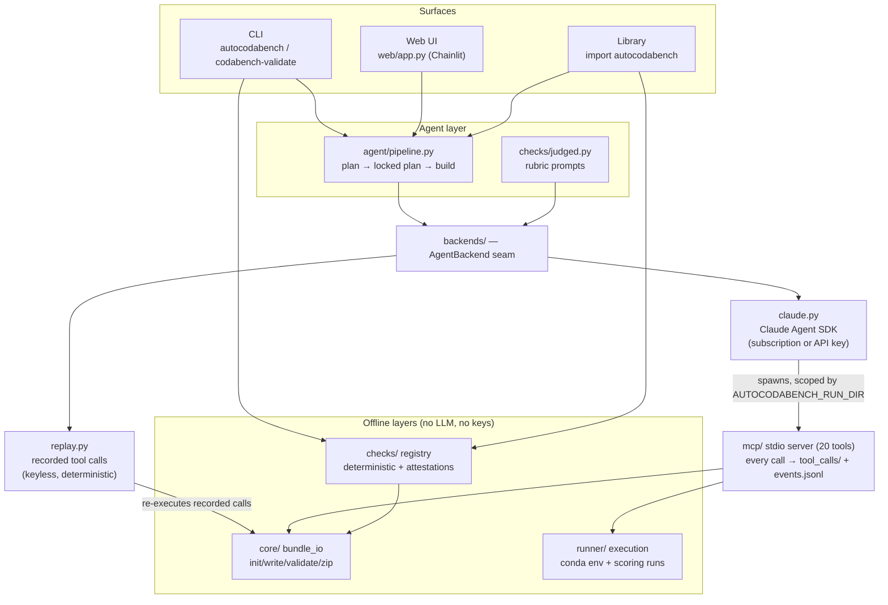

# autocodabench — architecture

This is the maintainer's map of `src/autocodabench/`. End-user docs live in
[`INSTRUCTION_FOR_USER.md`](./INSTRUCTION_FOR_USER.md); read that first if
you just want to USE the tool.

---

## The one-paragraph version

autocodabench decomposes competition authoring into a **plan** phase and a
**build** phase, executed by independent agent sessions that communicate
only through a human-reviewable plan document. Agents act exclusively
through a surface of typed MCP tools, so every authoring action is logged
and replayable. Beneath the agent layer, a pure bundle-I/O core and an
offline check framework run without LLM or network access and are
unit-tested conventionally. Generated (or hand-written) competitions are
validated by registered checks in three tiers — deterministic gates,
LLM-judged advisories, human attestations — each citing its source. Model
access is isolated behind a single backend seam with two shipped
implementations: live (Claude Agent SDK) and record/replay, so the full
pipeline runs deterministically without API keys.

---

## Layout

```
src/autocodabench/
├── __init__.py              # public facade: create(), validate(), __version__
├── auth.py                  # subscription-vs-API-key status + probe
├── run_log.py               # run dirs, events.jsonl, tool_calls/ snapshots,
│                            #   logged_tool decorator (full audit trail)
├── run_log_hook.py          # Claude Code hook: mirrors transcripts into runs
│
├── core/                    # PURE: no LLM, no network, no MCP
│   ├── config.py            # path resolution (workspace/bundles/runs roots)
│   └── bundle_io.py         # init/write/attach/validate/zip on dicts + files
│
├── runner/                  # runtime counterpart of core
│   └── execution.py         # per-run conda envs, ingestion/scoring/notebook
│                            #   execution, live-tee'd subprocess logs
│
├── checks/                  # the validation framework
│   ├── base.py              # Check / CheckResult / CheckContext / registry
│   ├── facts.py             # competition_facts.yaml (declare-then-verify)
│   ├── deterministic.py     # code-computed gates + findings
│   ├── judged.py            # LLM-graded advisory checks (via backends)
│   ├── attestations.py      # human-only launch criteria
│   ├── report.py            # ValidationReport (dict + markdown)
│   └── api.py               # validate_bundle_path(dir-or-zip)
│
├── backends/                # the model-runtime seam
│   ├── base.py              # AgentBackend protocol, AgentTask, AgentRunResult
│   ├── claude.py            # live: Claude Agent SDK (lazy import)
│   ├── replay.py            # keyless: re-execute a recorded run's tool calls
│   └── fixtures/            # shipped demo fixture (see scripts/make_demo_fixture.py)
│
├── agent/                   # the plan→build pipeline
│   ├── prompts.py           # skill bodies + per-surface runtime footers
│   └── pipeline.py          # create(): two sessions joined by the locked plan
│
├── mcp/                     # ONE interface over core+runner (FastMCP stdio)
│   ├── instance.py          # the shared FastMCP() object
│   ├── server.py            # python -m autocodabench.mcp.server
│   └── tools/               # 20 thin @mcp.tool wrappers, all @logged_tool
│
├── upload/                  # Codabench REST upload (no LLM)
│   ├── codabench_api.py     # canonical 4-step flow (token→placeholder→PUT→poll)
│   └── service.py           # upload_zip() used by MCP tool + web route
│
├── cli/main.py              # autocodabench {demo,validate,create,auth,checks}
│                            #   + codabench-validate alias
└── skills/                  # versioned behavioral contracts per phase
    └── <name>/SKILL.md      #   (+ README.md documenting provenance)
```

---

## Design vocabulary (why it's built this way)

| Component | Design term | The sayable why |
|---|---|---|
| 20 small MCP tools instead of one big "do it" call | narrow interface / capability boundary | The agent can only act through typed, logged operations; the tool trace is a complete, replayable account of every authoring action. |
| `SKILL.md` per phase | behavioral contract | Each phase's permissions, inputs, and outputs are declared in a versioned document — auditable and diffable like code. |
| plan → build with only the locked plan crossing | separation of concerns + data contract | Planning is reviewable by a human before any artifact is generated; the plan is the interface between thinking and doing. |
| fresh agent session per phase | isolation | No hidden state crosses phases; everything that matters is in the artifact, which is why runs are reproducible from artifacts alone. |
| `core/` importable with no MCP/LLM | layering / pure core | The file layer is usable and unit-testable by itself. |
| deterministic vs judged vs attestation check tiers | test oracle discipline | "Valid" is defined by executable checks; LLM judgments advise, never gate; human-only criteria are surfaced, never assumed. |
| `competition_facts.yaml` | declare-then-verify | Checks that need context the bundle can't carry consume declared facts — and SKIP loudly when a fact is missing. |
| `AgentBackend` with live + replay implementations | backend abstraction | The model runtime has a slot, not a hard binding; replay makes CI and keyless review possible. |
| `tool_calls/` + `events.jsonl` per run | structured observability | Every run is a dataset; experiments are queries over it — and any run doubles as a replay fixture. |

---

## Key invariants

- **No repo assumptions.** The package is pip-installable; artifact roots
  resolve explicit-arg → env (`AUTOCODABENCH_HOME` /
  `AUTOCODABENCH_BUNDLES_ROOT` / `AUTOCODABENCH_RUNS_ROOT`) →
  `<cwd>/.autocodabench/`.
- **Per-session isolation.** `resolve_bundle_dir(slug)` scopes bundles into
  `<AUTOCODABENCH_RUN_DIR>/bundles/<slug>/` when a run is active. Two
  concurrent sessions can't collide.
- **Run-dir adoption.** `current_run()` adopts `AUTOCODABENCH_RUN_DIR` on
  first call — a fresh MCP subprocess reliably resolves to its parent's
  session, not to the global `LATEST` symlink.
- **Every tool call is captured.** `logged_tool` wraps each `@mcp.tool` so
  request + response + duration land under `<run>/tool_calls/NNNN_<tool>.json`
  plus a line in `<run>/events.jsonl`. This audit format **is** the replay
  fixture format — `ReplayBackend.load_fixture()` reads either a `.jsonl`
  fixture or a run dir directly. Don't break that duality.
- **The unit suite stays keyless.** Live-SDK behavior is verified manually
  (`codabench-validate --judged`, `autocodabench auth status --probe`);
  nothing in `tests/` may require auth or network.
- **`fastmcp` is pinned to exactly 2.14.7** — looser constraints let pip's
  solver pick a release that breaks on HF Spaces (see the pyproject and
  Dockerfile comments).

---

## Runtime architecture



What the picture encodes:

- **Phases communicate only through versioned artifacts** (plan, bundle,
  manifest); any phase can be rerun or audited in isolation.
- **The agent acts only through the MCP tool surface**; the tool log is a
  complete, replayable account of every action.
- **The bottom layers contain no LLM calls and run offline** — they are
  unit-tested conventionally; agentic behavior is exercised by replaying
  recorded tool traces.
- **The web UI is a downstream consumer of the library**, not a fork of it.

---

## MCP tools (20)

| Group | Tools |
|---|---|
| Run + logging | `open_run`, `current_run`, `log_event`, `snapshot_spec` |
| Bundle authoring | `init_bundle`, `write_competition_yaml`, `write_page`, `write_scoring_program`, `write_ingestion_program`, `write_solution`, `attach_data` |
| Validate + package | `validate_bundle`, `zip_bundle` |
| Execution | `prepare_run_env`, `install_env_extras`, `run_baseline_submission`, `run_user_submission`, `run_starting_kit`, `remove_run_env` |
| Publish | `upload_bundle` (explicit user request only) |

All are prefixed `autocodabench_`. In-process tool-count check:

```bash
python - <<'PY'
import asyncio
from fastmcp import Client
from autocodabench.mcp.instance import mcp
from autocodabench.mcp import tools  # noqa: F401 — registers tools

async def main():
    async with Client(mcp) as c:
        print(f"OK: {len(await c.list_tools())} tools")

asyncio.run(main())
PY
```

---

## Developing

```bash
pip install -e '.[dev]'
python -m pytest tests/                  # keyless, sub-second
python -m autocodabench.core.bundle_io   # core smoke test
python scripts/make_demo_fixture.py      # regenerate the shipped fixture
```

Adding a check: subclass `checks.base.Check` (or `checks.judged.JudgedCheck`),
set `id` / `title` / `tier` / `severity` / `citation` (and `requires_facts`
if it consumes declared facts), implement `run()`, and decorate with
`@register`. It appears in `autocodabench checks list` and in every
validation report automatically.

Adding a backend: implement `backends.base.AgentBackend` (`name` +
`async run(task) -> AgentRunResult`). Everything above the seam — pipeline,
judged checks, CLI, web — works unchanged.
